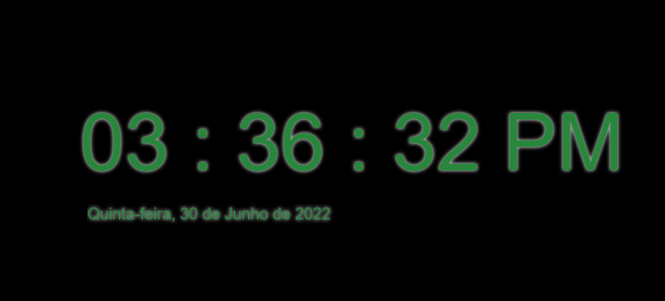

<h1>Digital Clock</h1>

digital clock is an application that displays the date information of the carrier machine in real time.

<h2 style='color: #c3c3c3'>The following technologies were used to create the project:</h2>

- HTML5

- CSS3

- Javascript
